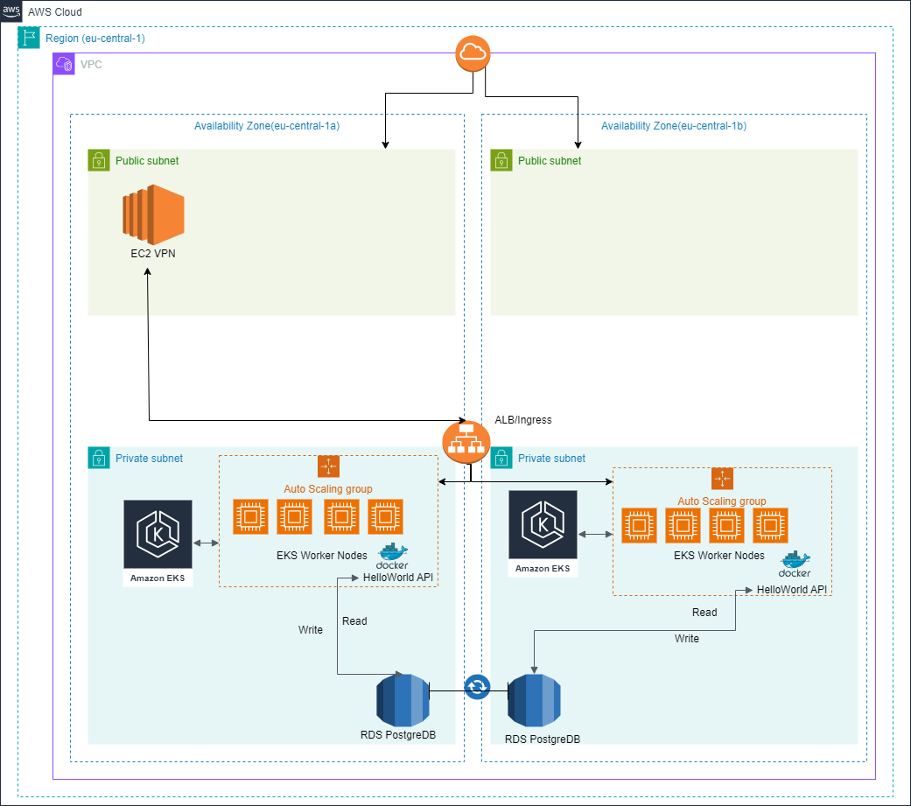
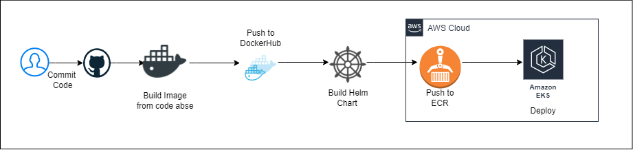

# HelloWorld API

This repository contains a HelloWorld API that can be deployed using Helm on EKS.

## Prerequisites

Before deploying the FastAPI application, make sure you have the following installed and set up:

- Docker, Docker Compose
- Helm
- Python, Pip, Pytest
- Make
- Terraform

## Setup

1. **Run the API locally**:
   ```bash
   make init
   make start
   ```

2. **Access the API locally**:

API documentaion - http://localhost:8000/docs#/

   ```bash
      curl -X 'PUT' 'http://localhost:8000/hello/Pankaj' -H 'accept: */*' -H 'Content-Type: application/json' -d '{"date_of_birth": "2024-06-27"}'
      curl -X 'GET' 'http://localhost:8000/hello/Pankaj' -H 'accept: application/json'
   ```

3. **Run the tests locally**:

   ```bash
   make unit
   ```

## Create Terrafrom AWS resources (Requires AWS credentials to be setup)
All the terraform configuration files are kept in .infra folder

terrafrom plan

   ```bash
   terraform plan -var-file="prod.tfvars"
   ```

terrafrom apply

   ```bash
    terraform apply -var-file="prod.tfvars"
   ```

## Deploy to k8s(EKS)
GitHub workflow will trigger when main branch is modified. This job will create new docker image and new version of helm chart.

To deploy from local system

   ```bash
   helm install hw-api oci://975050092864.dkr.ecr.eu-central-1.amazonaws.com/hw-api --version 7 -n hw-api
   ```

## System Overview



## CI/CD Overview

